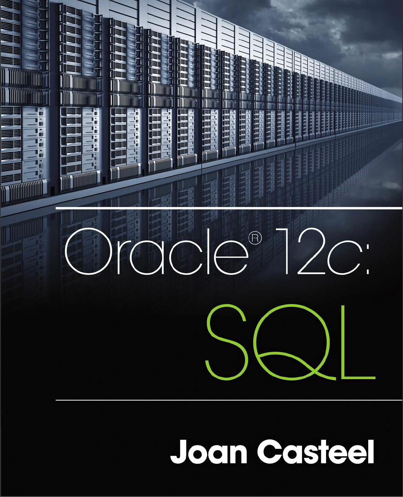

# README

This book is excellent and worthy reading because it has a main thread about how to maintain a bookstore and clear explanations.  I highly recommend this book if you want to add Oracle 12c into your skill library.

I always used Mysql in my working environment, and it is my first time to learn Oracle. I found the syntax is a little bit different from Mysql; therefore, I made notes and shared it with you guys.